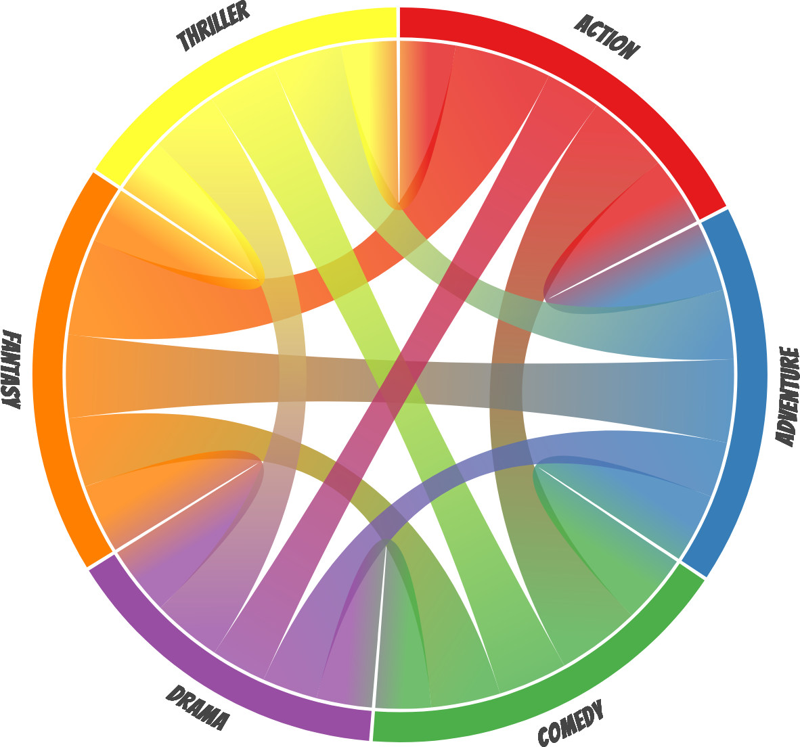
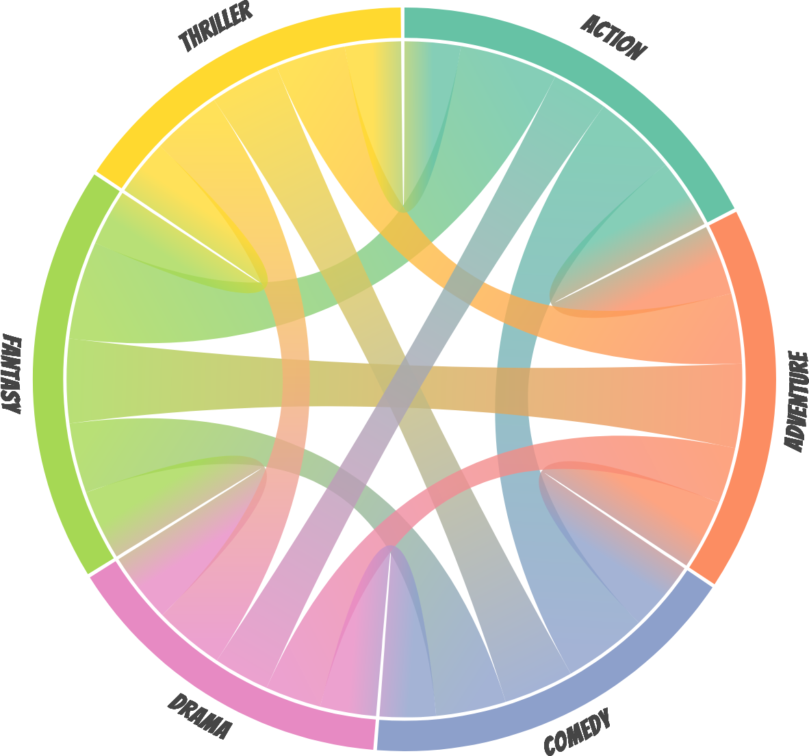
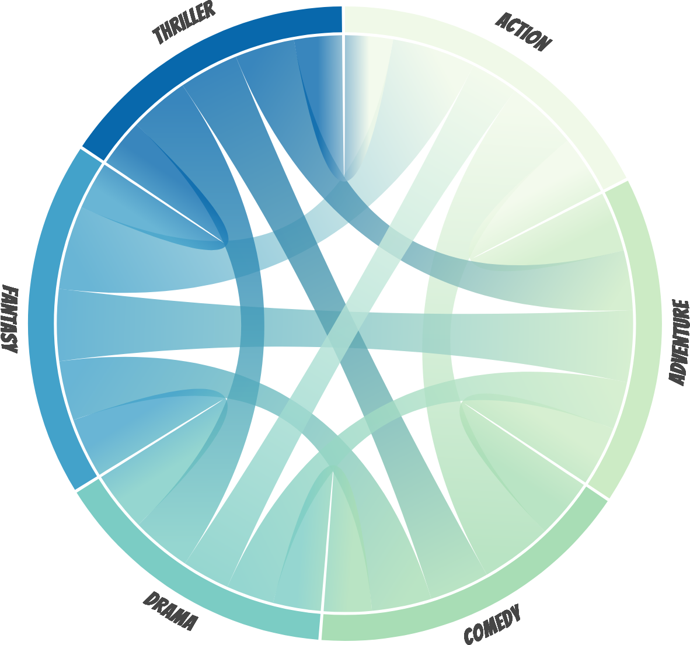
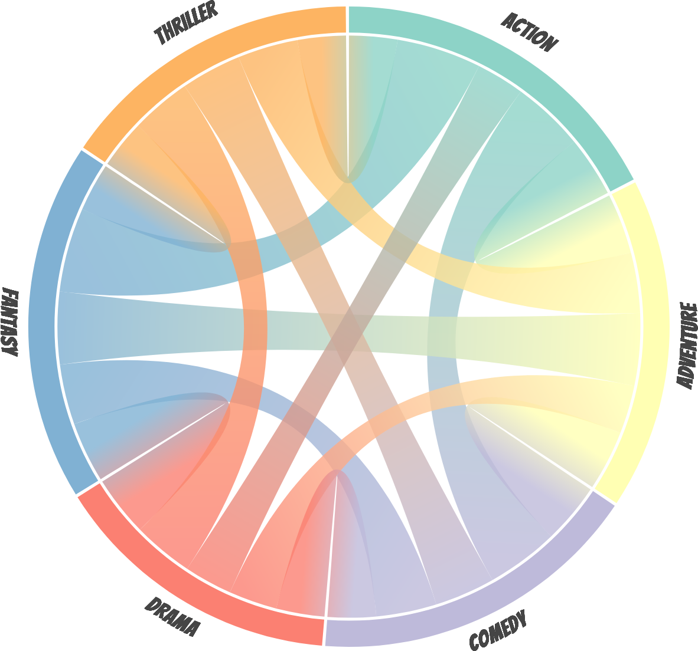
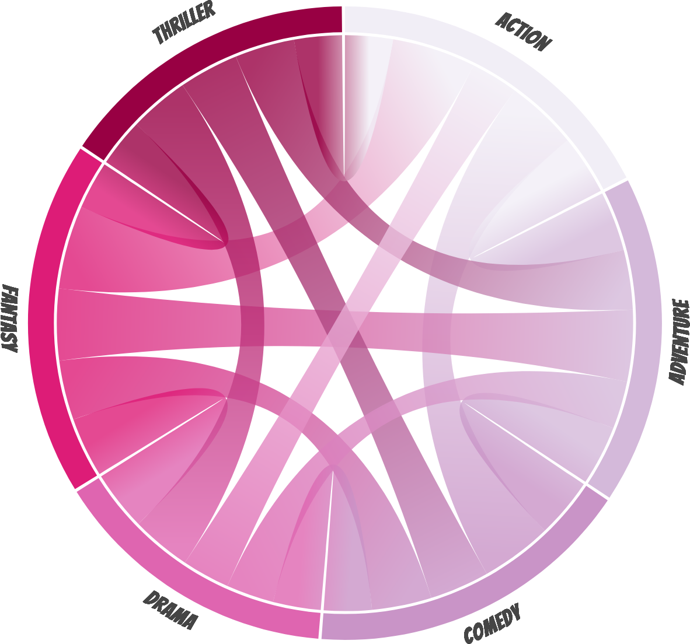
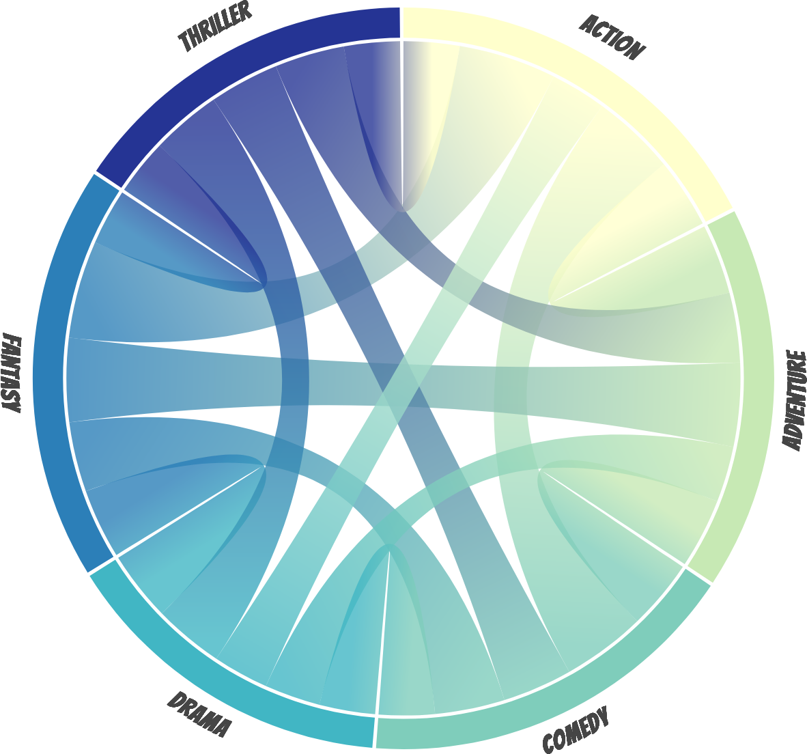
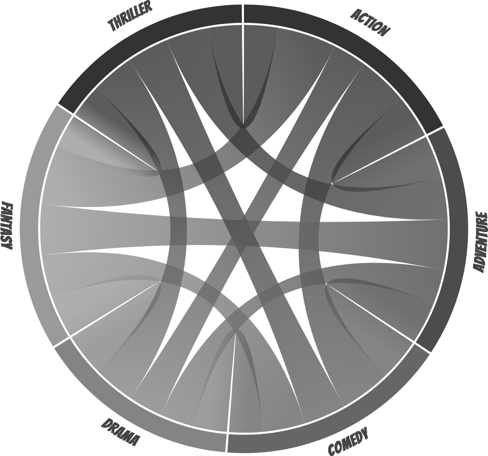
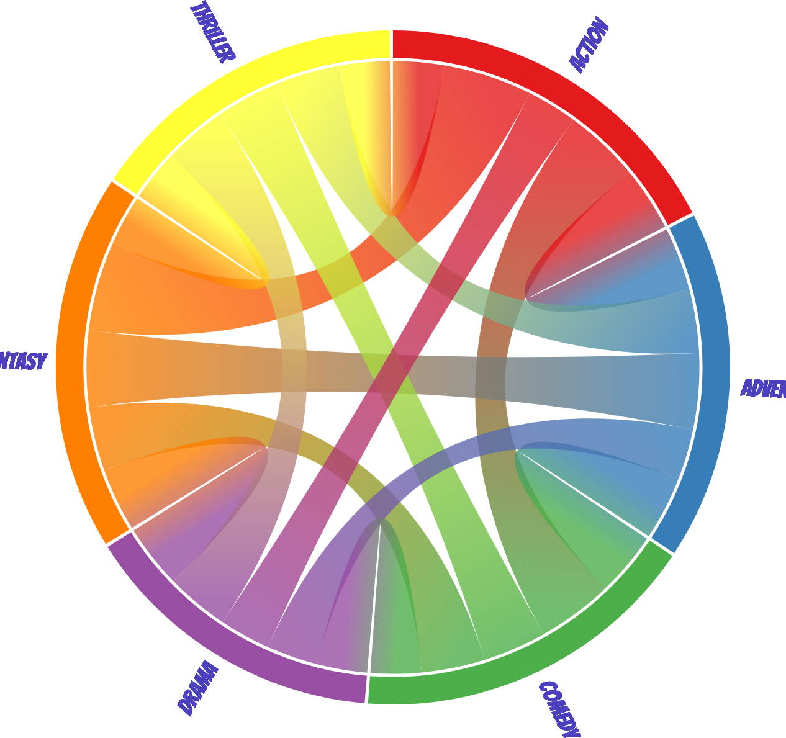
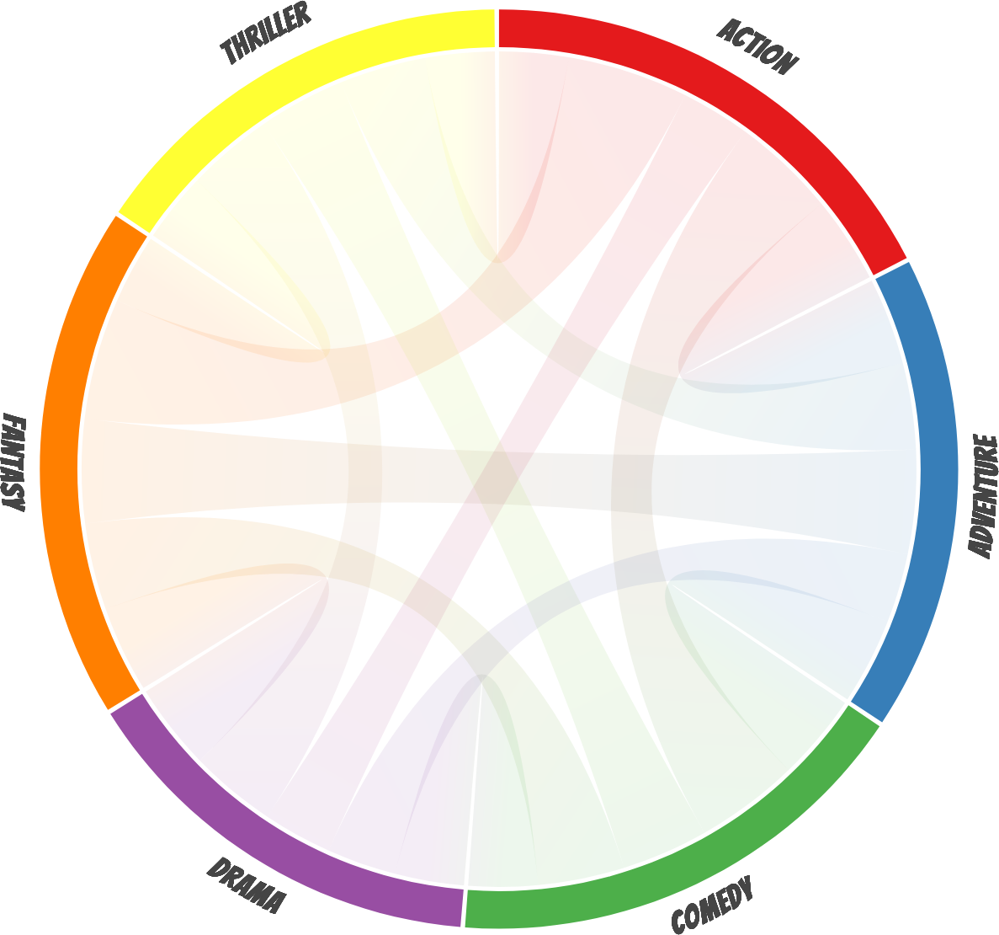

# Introduction

In a chord diagram (or radial network), entities are arranged radially as segments with their relationships visualised by arcs that connect them. The size of the segments illustrates the numerical proportions, whilst the size of the arc illustrates the significance of the relationships<sup id="fnref-footnote"><a class="footnote-ref" href="#fn-footnote">1</a></sup>.

Chord diagrams are useful when trying to convey relationships between different entities, and they can be beautiful and eye-catching.

# The Chord Package

I wanted to do a section on Chord Diagrams for my book, [Data Is Beautiful](https://store.shahinrostami.com/product/data-is-beautiful/).

With Python in mind, there are many libraries available for creating Chord diagrams, such as [Plotly](https://plotly.com/python/v3/filled-chord-diagram/), [Bokeh](http://docs.bokeh.org/en/0.12.0/docs/gallery/chord_chart.html), and a few that are lesser-known. However, I wanted to use the implementation from [d3](https://observablehq.com/@d3/chord-diagram?collection=@d3/d3-chord) because it can be customised to be highly interactive and to look beautiful.

I couldn't find anything that ticked all the boxes, [so I made](https://pypi.org/project/chord/) a wrapper around d3-chord myself. It took some time to get it working, but I wanted to hide away everything behind a single constructor and method call. The tricky part was enabling multiple chord diagrams on the same page, and then loading resources in a way that would support Jupyter Notebooks.


# Installation

Available on https://pypi.org/chord through `pip`:

```bash
pip install chord
```

# Examples

You can see the actual interactive examples [on this page](https://shahinrostami.com/posts/statistics/data-is-beautiful/chord-diagrams/). The below examples are screenshots.

## The Dataset

The focus for this section will be the demonstration of the `chord` package. To keep it simple, we will use synthetic data that illustrates the co-occurrences between movie genres within the same movie.

```python
matrix = [
    [0, 5, 6, 4, 7, 4],
    [5, 0, 5, 4, 6, 5],
    [6, 5, 0, 4, 5, 5],
    [4, 4, 4, 0, 5, 5],
    [7, 6, 5, 5, 0, 4],
    [4, 5, 5, 5, 4, 0],
]

names = ["Action", "Adventure", "Comedy", "Drama", "Fantasy", "Thriller"]
```

## Default Settings

Let's see what the `Chord()` defaults produce when we invoke the `show()` method.

```python
Chord(matrix, names).show()
```



## Different Colours

The defaults are nice, but what if we want different colours? You can pass in almost anything from [d3-scale-chromatic](https://github.com/d3/d3-scale-chromatic#categorical), or you could pass in a list of hexadecimal colour codes.

```python
Chord(matrix, names, colors="d3.schemeSet2").show()
```



```python
Chord(matrix, names, colors=f"d3.schemeGnBu[{len(names)}]").show()
```



```python
Chord(matrix, names, colors="d3.schemeSet3").show()
```


```python
Chord(matrix, names, colors=f"d3.schemePuRd[{len(names)}]").show()
```



```python
Chord(matrix, names, colors=f"d3.schemeYlGnBu[{len(names)}]").show()
```



```python
hex_colours = ["#333333", "#4c4c4c", "#666666", "#848484", "#9a9a9a"]

Chord(matrix, names, colors=hex_colours).show()
```



## Label Styling

We can disable the wrapped labels, and even change the colour.

```python
Chord(matrix, names, wrap_labels=False, label_color="#4c40bf").show()
```


## Opacity

We can also change the default opacity of the relationships.

```python
Chord(matrix, names, opacity=0.1).show()
```


<div class="footnote">
<hr>
<ol>
<li id="fn-footnote">
<p>Tintarev, N., Rostami, S., & Smyth, B. (2018, April). Knowing the unknown: visualising consumption blind-spots in recommender systems. In Proceedings of the 33rd Annual ACM Symposium on Applied Computing (pp. 1396-1399).&nbsp;<a class="footnote-backref" href="#fnref-footnote" title="Jump back to footnote 1 in the text">↩</a></p>
</li>
</ol>
</div>

# Credits

- d3-chord, Mike Bostock.
- d3-chord gradient fills, Nadieh Bremer.
- `chord` (Python), Shahin Rostami.